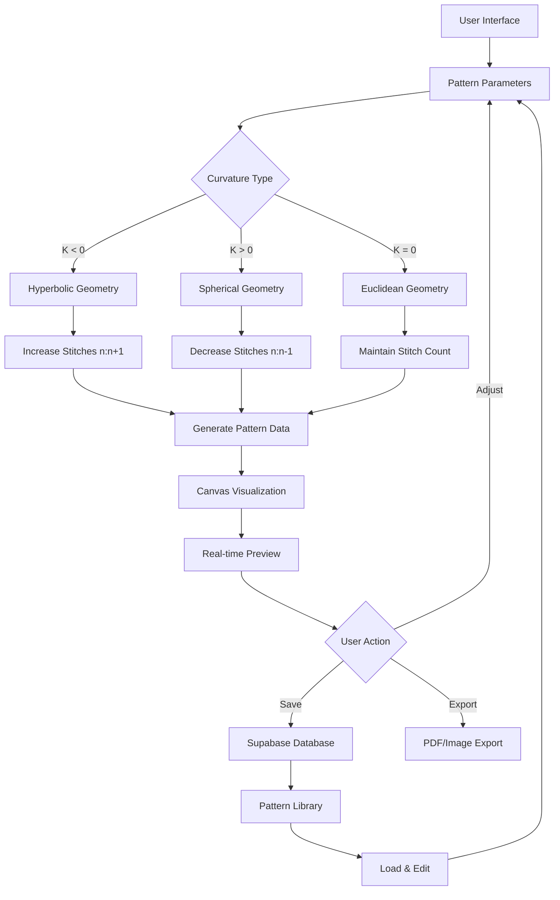

# Thalia Crochet - Architecture & Implementation Plan

## Project Overview
**Thalia Crochet** is a React-based pattern compiler dashboard that visualizes crochet patterns using geometric curvature mathematics. The application uses hyperbolic and spherical geometry to generate stitch patterns.

## System Architecture


## Tech Stack
- **Frontend**: React 18 + TypeScript + Vite
- **Styling**: Tailwind CSS with custom Artisan-Futuristic theme
- **Database**: Supabase (PostgreSQL)
- **Visualization**: HTML5 Canvas 2D
- **Icons**: Lucide React
- **Utilities**: clsx, tailwind-merge

## Project Structure
```
thalia-app/
├── src/
│   ├── components/
│   │   ├── PatternViewer.tsx      # Main canvas visualization
│   │   ├── Dashboard.tsx          # Main layout
│   │   ├── Navigation.tsx         # Sidebar navigation
│   │   └── PatternControls.tsx    # Curvature controls
│   ├── lib/
│   │   ├── supabase.ts            # Supabase client
│   │   ├── geometry.ts            # Curvature math utilities
│   │   └── theme.ts               # Theme configuration
│   ├── types/
│   │   └── index.ts               # TypeScript definitions
│   ├── App.tsx
│   └── main.tsx
├── public/
├── .env                           # Environment variables
├── tailwind.config.js
├── vite.config.ts
└── package.json
```

## Database Schema (Already Initialized)
1. **profiles** - User profiles
2. **patterns** - Saved crochet patterns
3. **stitch_library** - Stitch definitions and properties

## Curvature Mathematics
### Core Logic
```typescript
// Hyperbolic (K < 0): Increase stitches (n:n+1)
// Creates ruffles, corals, expanding surfaces
// Spherical (K > 0): Decrease stitches (n:n-1)  
// Creates domes, hats, contracting surfaces
// Zero Curvature (K = 0): Maintain stitch count
```

### Implementation
- `calculateStitchProgression(curvature: number, baseStitches: number): number[]`
- `generatePattern(curvature: number, rows: number): PatternData`

## UI/UX Design
### Color Theme (Artisan-Futuristic)
- **Primary**: Emerald (#059669) - Growth, nature, precision
- **Accent**: Gold (#fbbf24) - Craftsmanship, value, warmth  
- **Background**: Dark Slate (#0f172a) - Depth, sophistication
- **Text**: Slate-100 to Slate-300 for readability

### Dashboard Components
1. **Pattern Canvas** - 2D visualization of stitch patterns
2. **Curvature Controls** - Sliders for K values (-1 to +1)
3. **Pattern Library** - Grid of saved patterns
4. **Real-time Preview** - Live updates as parameters change
5. **Export Tools** - PDF/Image export functionality

## Implementation Phases

### Phase 1: Project Setup
1. Create Vite React TypeScript project
2. Install core dependencies
3. Configure Tailwind with custom theme
4. Set up Supabase client and environment

### Phase 2: Core Functionality
1. Implement curvature math utilities
2. Create PatternViewer canvas component
3. Build basic dashboard layout
4. Connect to Supabase for data persistence

### Phase 3: Enhanced Features
1. Add pattern saving/loading
2. Implement real-time collaboration
3. Add export functionality
4. Create user authentication flow

### Phase 4: Polish & Optimization
1. Performance optimization for canvas rendering
2. Responsive design improvements
3. Accessibility enhancements
4. Comprehensive testing

## Key Technical Decisions

### 1. Canvas vs SVG
- **Choice**: HTML5 Canvas 2D
- **Reason**: Better performance for dynamic, complex geometric visualizations with many stitch points

### 2. State Management
- **Choice**: React Context + useState
- **Reason**: Moderate complexity, good for real-time parameter updates without heavy dependencies

### 3. Data Flow
- **Pattern Parameters** → **Geometry Calculations** → **Canvas Rendering** → **Supabase Sync**

### 4. Responsive Design
- Mobile-first approach with breakpoints for tablet/desktop
- Canvas resizes proportionally to container

## Security Considerations
1. Supabase Row Level Security (RLS) for data protection
2. Environment variables for API keys
3. Input validation for curvature parameters
4. Rate limiting for API calls

## Performance Considerations
1. Canvas rendering optimizations (requestAnimationFrame)
2. Debounced parameter updates
3. Lazy loading for pattern library
4. Memoization for expensive calculations

## Testing Strategy
1. Unit tests for geometry utilities
2. Component tests for UI components
3. Integration tests for Supabase operations
4. Visual regression tests for canvas rendering

## Deployment
- **Platform**: Vercel or Netlify
- **Database**: Supabase (managed)
- **CI/CD**: GitHub Actions
- **Monitoring**: Sentry for error tracking

## Success Metrics
1. Canvas renders smoothly at 60fps with 1000+ stitches
2. Parameter updates reflect in <100ms
3. Pattern save/load completes in <2s
4. Mobile responsiveness across all breakpoints

---

*Last Updated: 2026-01-07*
*Architect: Roo (THALIA ARCHITECT)*